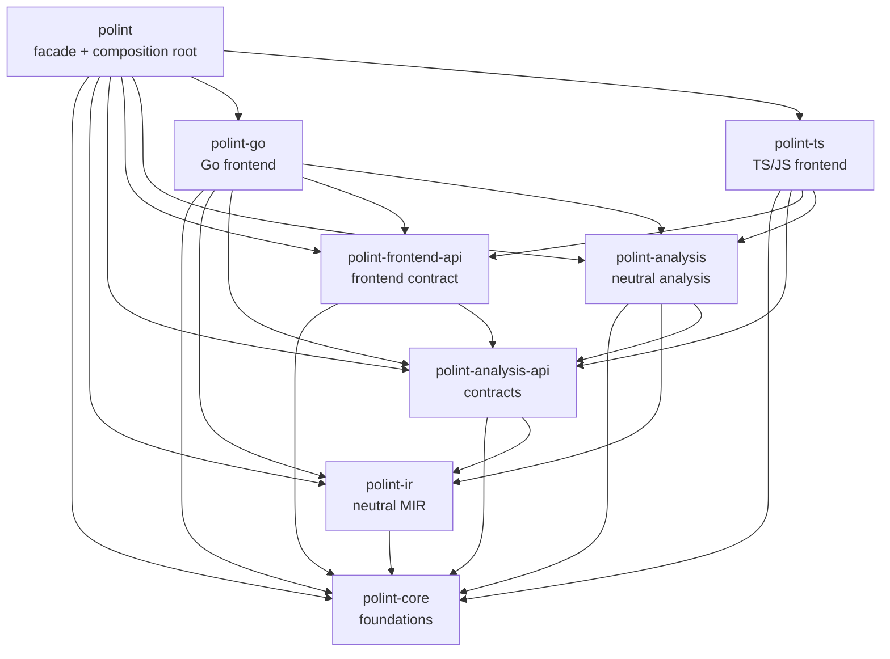

# polint architecture

This document describes the architecture implemented by the repository. It is a
boundary document: it explains ownership, contracts, and the supported extension
surface without turning implementation modules into public API. The product is a
framework for repo-local static-analysis rules. A repository supplies the policy;
polint supplies discovery, parsing, facts, diagnostics, analysis, caching, and
rule execution.

The architecture is organized around four rules:

1. **The facade composes; it does not define every algorithm.** The `polint`
   crate is the host and product boundary, while language frontends and neutral
   analysis are independently owned.
2. **Contracts point downward.** Foundational types, neutral IR, fact/provider
   contracts, and frontend contracts do not import concrete languages or the
   facade.
3. **Identity and precision are explicit.** Facts carry producer, precision,
   validation, and stable identity information. Unknown or setup-missing
   information is represented rather than silently promoted to exact facts.
4. **Determinism is a product property.** Parallel work is allowed, but stable
   ordering, resolved identity text, schema/version inputs, and canonical
   serialization make equivalent runs produce equivalent facts, diagnostics,
   and cache keys.

## Crate graph and ownership

The binding product architecture has eight crates. In the table and diagram,
an edge points from a consumer to a direct internal dependency.



| Crate | Owns | Direct internal dependencies |
| --- | --- | --- |
| `polint-core` | IDs, spans, diagnostics, language tags, `LanguageId`, `StableKeyId`, and the stable-key interner | — |
| `polint-ir` | Language-neutral MIR blocks, operations, terminators, places, and type shapes | `polint-core` |
| `polint-analysis-api` | `FactDatabase`, erased `FactStore`, provider manifests/context/results, fact metadata, source/fact schemas, digests, and cache contracts | `polint-core`, `polint-ir` |
| `polint-frontend-api` | `LanguageFrontend`, frontend profiles, `AnalysisUnit`, and the frontend registry contract | `polint-core`, `polint-analysis-api` |
| `polint-analysis` | Language-neutral stores, graph models, CFG/calls/data-flow/IFDS, domains, summaries, identity, solvers, metrics, and analysis providers | `polint-core`, `polint-ir`, `polint-analysis-api` |
| `polint-go` | Go/tree-sitter parsing, Go lifecycle and sidecar integration, Go stores/lowering, and Go graph adapters | `polint-core`, `polint-ir`, `polint-analysis-api`, `polint-frontend-api`, `polint-analysis` |
| `polint-ts` | Oxc TS/JS parsing, TS/JS stores/lowering, resolver/lifecycle integration, and TS/JS graph adapters | `polint-core`, `polint-analysis-api`, `polint-frontend-api`, `polint-analysis` |
| `polint` | The user-facing facade, CLI/SDK/runner, host database, registry, provider kernel, config/filesystem integration, cache, and composition root | the seven crates above |

The graph is intentionally a cut set, not a claim that every workspace crate is
part of the product layering. `polint-macros` supplies the rule attribute,
`polint-eval` supplies internal evaluation support, `polint-bench` consumes the
bench-only surface, and the example rule packs are external-style consumers.
Those tooling and example crates do not add another product layer.

### Dependency boundaries

The compiler enforces these directions:

- `polint-core` has no dependency on another polint crate and must not know
  concrete facts, parsers, providers, or analysis algorithms.
- `polint-ir` depends only on the foundations. It is the shared representation
  consumed by frontends and analyses, not a place for language-specific lowering.
- `polint-analysis-api` contains contracts and neutral schemas only. It must not
  import `polint-analysis`, `polint-go`, `polint-ts`, or `polint`.
- `polint-frontend-api` describes a frontend without naming a concrete frontend.
- `polint-analysis` targets `FactDatabase`, `FactStore`, `AnalysisHost`, and
  other neutral contracts. It must not depend on a concrete frontend or on the
  facade. Algorithms are reusable against a host, not coupled to the facade's
  concrete database type.
- `polint-go` and `polint-ts` may consume neutral analysis and contracts, but may
  not depend on one another or on the facade. Each owns its parser, lifecycle,
  language-specific lowering, and language-specific graph adaptation.
- `polint` is the one composition root. It is the only product crate that
  intentionally names both concrete frontends and assembles all provider
  families with repository services.

A new module should first be placed in the crate that owns its inputs and
invariants. A public re-export is an API decision, not a convenience shortcut.

## Facade, host, and public API

`polint` binds a repository invocation to the neutral contracts. Its private
host owns `AnalysisDb`, source loading, configuration, the analysis plan, cache
adapters, frontend registration, provider scheduling, diagnostics/reporting,
and rule execution. `AnalysisKernel` is the composition root for the analysis
run:

1. load and scope source files;
2. collect rule metadata and derive the requested capability plan;
3. create an input snapshot and select the provider closure;
4. run the declared provider order through `ProviderCtx`;
5. validate fact metadata, finalize stores, and return facts, diagnostics, and a
   run report to the rule runner.

The facade's host implements the object-safe contracts from
`polint-analysis-api`. Provider wrappers may downcast the contract at this one
composition boundary to the host's concrete database; neutral algorithms do
not do that.

The supported rule-author surface is deliberately small:

- **`polint::sdk`** contains the documented SDK namespaces, typed fact views,
  diagnostics, rule context, options, policy vocabulary, and scope helpers.
- **`polint::sdk::prelude`** is the curated import surface used by generated and
  hand-written rules. Its allowlisted contents are tested as a public contract.
- **`polint::runner`**, especially `polint::runner::run_cli`, is the supported
  rule-pack runner/registration entry point.
- **`polint::rule`** is the stable facade re-export of the procedural attribute
  macro.

The facade's `core`, `analysis`, `analysis_kernel`, `cache`, `config`, `fs`,
`frontend`, `go`, `ts`, graph modules, provider manifests, stores, and other
crate-root implementation modules are not supported rule-author imports. The
bench-only `polint::_bench` tree and `#[doc(hidden)]` helpers are internal
integration hooks, not a general extension API.

A `#[polint::rule]` function is plain, synchronous Rust with `&mut RuleCtx<'_>`
first and a `RuleResult` return. Fact-view parameters such as `Imports<'_>`,
`Functions<'_>`, metrics views, or changed-file views are the rule's typed read
capabilities. The macro derives requested capabilities from canonical SDK fact
views. `RuleCtx` supplies diagnostics, paths, options, and capability/setup
metadata; it is not a back door to the entire fact database. New fact families
must become typed, documented SDK views before they are advertised to authors.

## Facts, IR, and analysis contracts

### Source and fact spine

The host source spine gives every discovered file a `FileId`, normalized
repository-relative path, language tag, shared source text, and content hash.
Language frontends add syntax facts through `FactDatabase`; whole-repository
providers add derived facts through typed or erased stores. `FactStore` is an
object-safe storage boundary so the API crate can name a family without owning
its implementation.

Fact metadata records the family, producer/layer, run identity, precision,
confidence, validation status, payload digest, stable identity, and ownership
information needed to validate replacement and conflicts. This keeps the
analysis graph inspectable without exposing the host's concrete stores to rule
packs.

`polint-ir` is the neutral MIR boundary. Go and TS/JS lower their syntax and
semantic information into MIR bodies, blocks, operations, terminators, places,
and type shapes. Shared CFG, calls, domains, summaries, IFDS/data-flow, and
solver code consume that MIR instead of reparsing source or maintaining
language-specific algorithm copies.

The SDK exposes stable typed projections rather than raw ASTs, MIR dumps, graph
nodes, solver worklists, or provider-internal debug rows. Existing views include
source files, packages, functions, imports, resolved imports, symbols,
references, Go tests, TS/JS facts, literals, JSX attributes, metrics, and
changed files. Higher-level policy views expose bounded queries over supported
signals. Every fact document under [`docs/facts/`](docs/facts/) must state its
precision and limits.

### Frontend contract

`polint-frontend-api` defines the language-neutral frontend boundary:

- `FrontendProfile` declares a stable profile name, language family, produced
  fact labels, and a precision ceiling.
- `AnalysisUnit` passes the selected source files and repository root without
  transferring ownership of the host database.
- `LanguageFrontend` supplies an ID, path predicate, profile, and `analyze`
  method that returns a `ProviderRunResult`.
- `FrontendRegistry` assigns internal `LanguageId` handles at registration,
  finds frontends by profile name, and schedules path matches in stable profile
  name order. Registry numeric IDs are handles, not user-visible sort keys.

A frontend depends on the cache and provider contracts, not on facade cache
implementation. It emits neutral facts and diagnostics through `ProviderCtx`.
Language-specific parsing, lifecycle, resolution, and lowering remain in the
language crate.

### Provider contract and execution

`polint-analysis-api` defines the provider vocabulary used by both frontends and
whole-repository analyses:

- `ProviderManifest` declares an ID, kind, input fact families, output families,
  language scope, cache policy, schema versions, and precision ceiling.
- `Provider` implements `manifest()` and `run()`.
- `ProviderCtx` supplies mutable `FactDatabase`, host services, config and rule
  digests, the parallelism choice, upstream provider output digests, and an
  opaque host attachment for composition-root side channels.
- `ProviderRunResult` returns diagnostics, cache statistics, and an optional
  output digest.
- `ProviderHostServices` exposes only host capabilities such as the plan digest
  and opaque analysis cache. `HostAttachment` carries root-owned plumbing
  without adding facade knowledge to neutral providers.

The kernel maintains a topologically valid, manifest-index-stable provider
order. The normal shape is:

```text
source discovery
  -> Go syntax and TS/JS syntax
  -> module graph
  -> symbol graph and module topology
  -> semantic MIR
  -> CFG and call sites
  -> language semantic enrichment (Go sidecar where requested)
  -> identity, abstract domains, direct summaries, entrypoints,
     reachability, extensions, type/value/alias facts, and semantic graph
  -> solver and refined calls
  -> data flow and evidence
```

Metrics form a supported derived branch from source/functions. The actual
provider graph has additional edges and capability gates; the diagram is the
conceptual dependency spine, not a promise that every provider runs for every
rule. A plan requests only the closure needed by enabled rules, and output
records/digests preserve the declared provider identity even when a provider is
not selected.

Capabilities are planned before execution. The plan expands dependencies,
checks language support and setup, and records `Supported`, `Unsupported`, or
`SetupMissing` status with a reason, hint, and documentation path. A blocked
hard capability produces structured `polint/capability` diagnostics and the
rule does not run with fabricated facts. A view's Rust type name alone never
turns an unsupported capability into a supported one.

## Identity and interning

`polint-core` owns `StableKeyId` and `StableKeyInterner`. In production the
interner is scoped to an `AnalysisDb`/analysis host. The process-wide helper is
hidden and test-only; it is not a production identity service. Cloning a host
preserves the known key table while allowing detached future allocations.

Stable identity has two boundaries:

- Interned IDs provide compact equality, membership, and owner-map keys inside a
  run. Fact metadata and owner maps use `StableKeyId`, so there is one identity
  representation rather than parallel string and ID fields.
- Resolved stable-key text is the canonical boundary for human-visible output,
  cache/digest payloads, wire/debug representations, conflict evidence, and any
  lexical ordering. Numeric allocation order is never treated as semantic sort
  order and is never an external identity.

Every identity-producing family constructs its key through the host interner.
Stores normalize and validate rows before publication. The neutral identity
provider projects functions and call sites without mutating their source facts,
deduplicates and sorts records, assigns dense run-local record IDs after
normalization, and computes output digests from stable payload text. Dense IDs
are convenient indexes, not persistent identities.

This separation matters for parallelism and cache reuse: two equivalent runs may
intern text in different encounter orders, but their resolved-text payloads,
normalized rows, diagnostics, and output digests remain the same. A new fact
family must define its stable-key recipe, ownership/duplicate behavior,
normalization order, and text serialization before it is connected to a
provider.

## Language lifecycle and graph adapters

The language crates own the parts that are impossible to make neutral: parser
invocation, project configuration, module/package discovery, import resolution,
language semantic enrichment, and lowering from language syntax to neutral
facts/MIR. Graph assembly and reusable graph algorithms stay in
`polint-analysis`.

### Go

`polint-go` uses tree-sitter for syntax extraction and owns the Go semantic
sidecar integration. The lifecycle is deliberately monorepo-safe:

- Go files are associated with the nearest `go.mod`, unless
  `[languages.go].module_roots` explicitly selects roots.
- `package_patterns`, `build_tags`, `include_tests`, and `offline` are lifecycle
  inputs in the single `.polint.toml` configuration. They are part of the
  relevant input/cache digests.
- A checked-in `go.work` is used only when it covers every selected module root.
  For multiple roots or a root without an adequate workspace, the analyzer
  creates an internal temporary workspace. It does not write generated
  lifecycle files into the repository.
- Go package loading uses the selected roots and patterns, and semantic results
  include package/function/call, method-set, address-taken, instantiation, and
  dynamic-dispatch information when the sidecar can provide them.
- Missing roots, files outside configured roots, unavailable/unsupported Go
  toolchains, package-load failures, protocol failures, and timeouts are
  surfaced as setup or semantic diagnostics. The provider stores no placeholder
  semantic facts for a failed setup.

The Go graph adapter parses `go.mod`, `go.work`, and lock/checksum evidence,
combines it with package metadata, and emits neutral workspace-root,
module/package, source-set, dependency-requirement, resolved-dependency, file,
and import edges. It preserves exact, missing, unresolved, external, and
setup-missing status/precision instead of forcing every edge into a resolved
shape.

### TypeScript and JavaScript

`polint-ts` uses Oxc for TypeScript, TSX, JavaScript, and JSX parsing and fact
extraction. Parser errors become file diagnostics while recoverable syntax facts
retain their explicit precision. The adapter has file and syntax-layer cache
paths and merges results in normalized repository path order.

TS/JS project and module ownership is discovered from nearby `tsconfig.json` and
`package.json` files. `oxc_resolver` handles file resolution and path aliases;
package manifests, workspace declarations, pnpm workspace metadata, selected
lockfiles, and source-set information feed the topology adapter. Import results
can be exact-file, external-package, unresolved, dynamic, or setup-missing with
corresponding precision/reason codes. A dynamic import expression is not
silently treated as a statically resolved edge.

The TS/JS adapter emits neutral module-graph drafts and language facts. The
neutral module graph builder in `polint-analysis` owns node/edge normalization,
relationship queries, topology projections, and deterministic assembly. The
same split applies to symbol graphs: language crates extract language-specific
symbols and bindings, while neutral consumers use the common symbol/reference
model.

### Module and symbol graph model

`polint-analysis::module_graph` owns the neutral graph model, builders, topology
facts, resolution status/precision, and queries. Go and TS/JS provide seeds and
resolvers; they do not duplicate the neutral graph algorithms. The module graph
feeds package ownership and module topology, then the symbol graph and MIR
providers. Symbol/reference facts retain language-specific namespace and
resolution status but share stable identity and metadata rules.

Graph consumers must preserve uncertainty. `NotFound`, external dependencies,
dynamic expressions, unsupported resolver inputs, and missing semantic setup are
meaningful outcomes. Rules that require a hard capability receive a capability
diagnostic when the needed setup is unavailable; rules that consume a bounded
fact view can inspect the documented precision/status instead.

## Caching, digests, determinism, and errors

### Cache boundaries

The facade owns the default disposable cache under `.polint/cache` and adapts it
to the object-safe `AnalysisCache` contract. The main categories are file
analysis, syntax layers, derived data, and the repo-local rule-host build
cache. An optional semantic-store maintenance path is host-owned and is not a
public persistence contract.

File cache keys include the normalized relative path, source content hash,
loaded configuration, enabled rule/options digest, requested analysis-plan
digest, provider/schema identity, and polint version. Layer keys additionally
include provider version, parameter digest, lifecycle digest, tool invocation,
configuration, and input digests. Provider output digests include declared
schema/parameters and the output digests of consumed providers. Go lifecycle
settings, sidecar/tool versions, budgets, model/extension inputs, and other
behavior-affecting values are included in the corresponding digest inputs.

Rule custom settings live in `RuleOptions::settings` and participate in the
same deterministic rule/options digest as the built-in options. Adding a field
that changes analysis or rule behavior requires adding it to the relevant
canonical digest and a regression test.

Cache artifacts are an optimization, never a source of correctness. Disabled
cache paths do no cache I/O. Missing, malformed, schema-incompatible, unsafe,
or invalidated entries are treated as misses and evicted where appropriate;
cache write/read problems become controlled diagnostics rather than changing
fact semantics.

### Determinism

Determinism is maintained at every boundary:

- repository paths, package names, provider IDs, profile names, map keys, and
  fact rows use canonical lexical or declared order;
- frontend scheduling is by stable profile name, while `LanguageId` values are
  only registry handles;
- provider execution follows the stable topological manifest order and folds
  upstream output digests;
- parallel parser/extractor work is merged by normalized path and fact sort
  keys before publication;
- stable-key text, not interner numeric IDs, drives payloads, diagnostics,
  conflict evidence, cache digests, and user-visible sorting;
- diagnostic/reporting renderers sort their output through the product's
  deterministic ordering rules;
- budgets, toolchain identity, schema versions, precision, and setup status are
  explicit digest inputs rather than ambient assumptions.

The result is deterministic output without requiring sequential parsing or
forbidding parallel rule execution.

### Error and honesty contract

Parser failures are diagnostics tied to the source path and range. Provider
setup/process failures are controlled errors or structured diagnostics. Fact
stores validate producer, ownership, duplicate, reference, and metadata
invariants before downstream publication. Rule metadata and execution are
panic-contained so a faulty rule becomes an internal diagnostic rather than
crashing the host.

Precision ceilings (`Exact`, `Syntax`, and `SetupAware`), resolution status,
unknown reasons, budgets, omitted regions, and evidence paths are part of the
fact model. Heuristic or bounded analyses must expose their limits; an empty
answer is not automatically proof that no relationship exists. Public rule
views and documentation must not claim whole-program exactness when the
underlying provider has unresolved, unsupported, or budget-limited results.

## Extension guidance

### Adding a language frontend

1. Put parser, language lifecycle, module/package resolution, language stores,
   and language-to-MIR lowering in a new language crate. Depend on
   `polint-frontend-api`, `polint-analysis-api`, `polint-analysis`, and the
   foundational crates as needed; do not depend on another concrete frontend or
   `polint`.
2. Implement `LanguageFrontend` and a stable `FrontendProfile`. Emit neutral
   source/fact rows through `FactDatabase`, with explicit precision, status,
   metadata, stable-key recipes, and parser/setup diagnostics.
3. Adapt language-specific imports, modules, packages, and symbols into the
   neutral graph builders. Keep reusable graph assembly/query logic in
   `polint-analysis`.
4. Add the provider manifest and capability support needed by the new facts;
   register the frontend and provider in the facade's composition root. Do not
   expose a manifest or host store as the author API.
5. Include cache keys for parser parameters, lifecycle/setup inputs, toolchain
   identity, schema versions, and source content. Normalize parallel results and
   add reverse-order/determinism coverage.
6. Document the public fact views under `docs/facts/`, including precision,
   unsupported shapes, setup requirements, and heuristic limits. Add an
   outside-user temporary-repository test that imports only the public SDK and
   asserts a real diagnostic through the CLI.

### Adding an analysis family or provider

1. Define neutral input/output schemas and ownership in
   `polint-analysis-api`; implement the algorithm and stores in
   `polint-analysis` against `FactDatabase`/`AnalysisHost`.
2. Give the provider a manifest with honest inputs, outputs, language scope,
   schema, cache policy, precision ceiling, and deterministic output digest.
3. Add capability planning and setup checks before allowing a rule to run. A
   reserved or partially implemented internal type is not a supported fact
   family.
4. Add a typed SDK view with query methods only when the underlying facts are
   usable by external rules. Keep raw graph/solver internals private and avoid
   widening `RuleCtx`.
5. Wire the provider and facade host services in `polint`, then test capability
   diagnostics, cache invalidation, normalized output, panic/error behavior,
   and an external-style rule-pack invocation.

Do not add a manual capability declaration to compensate for a missing typed
view, add a compatibility/dual identity field, sort by registry or interner
allocation order, or make a neutral algorithm import a language crate. Those
choices defeat the architecture's compiler and determinism guarantees.

## Validation and maintenance

The architecture is guarded by both compiler boundaries and behavioral gates.
A full validation run for a tip should include:

```bash
cargo check --workspace --all-targets --all-features --locked
cargo fmt --all -- --check
cargo clippy --workspace --all-targets --all-features --locked -- -D warnings
cargo test --workspace --all-features --locked
cargo test -p polint --test public_surface_leak --locked
cargo test -p polint --test golden --locked
cargo test -p polint --lib eval::determinism_gate --locked
cargo test -p polint polyglot --lib --locked
RUSTDOCFLAGS="-D warnings" cargo doc --workspace --all-features --no-deps --locked
cargo deny check all
```

The structural checks should also confirm that `cargo metadata --no-deps`
contains exactly the eight binding product crates, that no concrete frontend is
a dependency of `polint-analysis`, that the supported facade paths remain
stable, and that all example rule packs compile through the public SDK. Golden
diagnostic sets must remain byte-identical for architecture-only changes; do
not regenerate them to mask a behavior change.

The final tip gate is a release-process concern, not an assertion made by this
document. Documentation changes do not make shipping complete; a release
candidate still needs the full gate run and the human-owned ship-preparation
record.

## Enduring non-goals

The following are deliberately outside this architecture's supported contract:

- replacing ESLint, Biome, Ruff, golangci-lint, formatters, type checkers, or
  general-purpose security scanners;
- shipping a built-in policy catalog instead of repository-owned rules;
- exposing full parser ASTs, raw fact stores, provider manifests, solver state,
  graph internals, or debug dumps as a stable rule-author API;
- claiming exact whole-program semantic coverage when a provider is syntactic,
  heuristic, setup-aware, unresolved, or budget-limited;
- making every language, package manager, framework, or external index work
  without a language-owned adapter and lifecycle contract;
- using a process-global interner, numeric allocation order, hidden generated
  lifecycle files, or cache contents as correctness dependencies;
- promising a public ABI for dynamically loaded providers or allowing neutral
  analysis to reach into a concrete language crate;
- treating full persistent fact storage or demand-driven/editor-latency
  execution as an author-facing guarantee. Those may be implemented behind the
  existing boundaries later, but they are not required for or implied by the
  current public architecture;
- promising unbounded solver precision, fixed wall-clock latency, or zero
  unknowns on large repositories. Budgets and conservative unknowns are part of
  the honest result model.

When a future feature crosses one of these boundaries, it must first define a
versioned contract, precision/error semantics, deterministic inputs, cache
invalidation, public visibility, and external-consumer tests. The existing
crate graph and supported facade should remain the default constraints.
