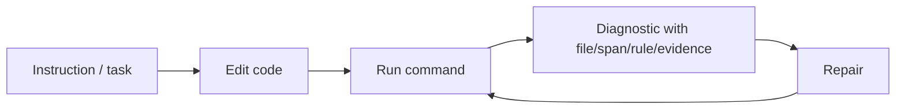
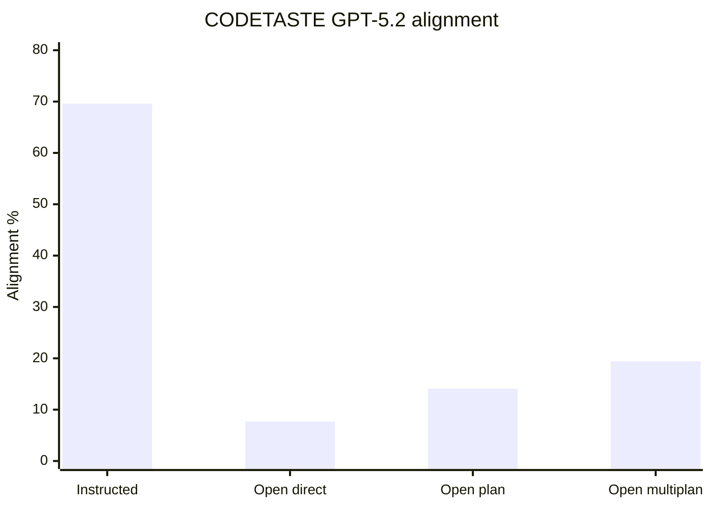
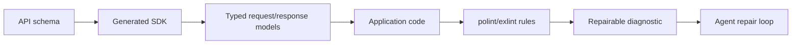

# Static Analysis for AI Agents

This research note ports the static-analysis-specific findings from the
`write-code-ai-agents-love` research corpus into the polint/exlint repository.
It is written as a product research artifact for the static-analysis platform,
not as a blog post.

The short thesis:

> AI agents fail when important repo constraints live only in prose, convention,
> or hidden runtime behavior. Static analysis turns some of those constraints
> into executable, inspectable feedback loops.

The important qualification:

> Static analysis does not replace tests, type systems, review, or human design
> judgment. Its role is to make mechanically detectable constraints visible at
> the exact moment the agent can still repair the code.

## Source Map

| ID | Source | Why it matters for polint/exlint |
|---|---|---|
| R43 | [Type-Constrained Code Generation](https://arxiv.org/abs/2504.09246) | Type information reduces invalid generated code and supports typed fact views. |
| R46 | [Needle in the Repo](https://arxiv.org/abs/2603.27745) | Functional tests miss structural maintainability failures; structural oracles matter. |
| R49 | [How Does Chunking Affect Retrieval-Augmented Code Completion?](https://arxiv.org/abs/2605.04763) | Retrieval units need declarations/context, not just function bodies. |
| R51 | [ToolGen](https://arxiv.org/abs/2401.06391) | Autocomplete/static tool access reduces dependency and static-validity failures. |
| R59 | [Investigating The Smells of LLM Generated Code](https://arxiv.org/abs/2510.03029) | LLM-generated code has higher smell incidence than professional references. |
| R60 | [A Causal Perspective on Measuring, Explaining and Mitigating Smells](https://arxiv.org/abs/2511.15817) | Smell propensity can be measured and mitigated, but static signals need interpretation. |
| R62 | [CrossCodeEval](https://arxiv.org/abs/2310.11248) | Cross-file API context materially improves repository completion. |
| R63 | [CatCoder](https://arxiv.org/abs/2406.03283) | Code and type context improve repository-level code generation. |
| R64 | [A3-CodGen](https://arxiv.org/abs/2312.05772) | Local/global/library-aware API retrieval helps; too much global context hurts. |
| R65 | [How Does Naming Affect LLMs on Code Analysis Tasks?](https://arxiv.org/abs/2307.12488) | Identifier names are retrieval and analysis metadata for LLMs. |
| R66 | [When Names Disappear](https://arxiv.org/abs/2510.03178) | Obfuscating names hurts semantic code understanding tasks. |
| R71 | [Constraint Decay](https://arxiv.org/abs/2605.06445) | Structural backend constraints cause measurable agent performance decay. |
| R72 | [CODETASTE](https://arxiv.org/abs/2603.04177) | Static rules can encode intended refactoring transformations beyond tests. |
| D13 | [ESLint custom rules](https://eslint.org/docs/latest/extend/custom-rules) | Mainstream proof that project-specific lint rules are a normal extension surface. |
| D14 | [typescript-eslint custom rules](https://typescript-eslint.io/developers/custom-rules/) | Type-aware rule authoring model for TypeScript. |
| D15 | [Semgrep custom guardrails](https://semgrep.dev/docs/secure-guardrails/custom-guardrails-rules) | Organization-specific guardrails in IDE/PR/pre-commit workflows. |
| D17 | [ast-grep lint rules](https://ast-grep.github.io/guide/project/lint-rule.html) | AST-pattern rules with globs, diagnostics, and fixes. |
| D18 | [Nx enforce module boundaries](https://nx.dev/docs/features/enforce-module-boundaries) | Mature example of architecture rules encoded as dependency constraints. |

## What Static Analysis Means Here

For this product, "static analysis" should not mean only AST pattern matching.
It should mean a stack of increasingly expensive, increasingly semantic facts:

| Layer | Fact family | Example polint/exlint use |
|---|---|---|
| File discovery | Paths, globs, ignore state, generated/vendor status | Scope rules to source files and exclude generated output. |
| Syntax | literals, imports, declarations, JSX attributes, branches | Design tokens, forbidden imports, branch obligations. |
| Metrics | LOC, complexity, function size, assertion counts | Maintainability and "no more complicated than before" gates. |
| Module graph | resolved imports, package exports, dependency direction | Architecture boundaries and public API discipline. |
| Symbols/references | definitions, references, re-exports | Rename/migration rules and dead public surface detection. |
| Type facts | TS checker, Go types, typed SDK models | Ban invalid/raw API calls and verify contract usage. |
| CFG | basic blocks, returns, throws, loops, branches | Resource cleanup, error handling, postcondition checks. |
| Dataflow | def-use, source/sink, value propagation | Validation-before-use and taint-like policies. |
| Call graph | direct/indirect calls, callbacks where known | Layering, side-effect isolation, route-to-handler paths. |
| Test/coverage facts | test names, assertions, coverage reports | Evidence that risky branches or policy exceptions are tested. |
| Structural oracles | repo-specific expected transformations | Migration/refactor correctness beyond behavior tests. |

The long-term static-analysis roadmap in
[`../ANALYSIS-ROADMAP.md`](../ANALYSIS-ROADMAP.md) already points in this
direction. This research note explains why those layers are product-critical
for AI-assisted development.

## Core Insight 1: Prose Is Weak Feedback, Diagnostics Are Repairable Facts

An agent prompt can say "do not call the database from UI code." A static
diagnostic can point at the exact import, name the violated rule, include
evidence, and explain the allowed repair.

That difference matters because AI agents operate in a loop:



Static analysis is useful when the diagnostic is precise enough to become part
of the repair loop. A broad instruction increases cognitive load. A diagnostic
anchors the repair to a file, span, rule ID, and expected policy.

## Core Insight 2: Structural Constraints Are Where Agents Lose Accuracy

Constraint Decay fixes a single backend API contract and then layers structural
constraints: architecture, database backend, and ORM integration. The benchmark
shows that agents can satisfy looser code-generation tasks but degrade sharply
as production-like constraints accumulate.

### Constraint Decay Data

| Measurement | Value | Product implication |
|---|---:|---|
| Greenfield generation tasks | 80 | Controlled constraint combinations. |
| Feature implementation tasks | 20 | Existing-codebase sanity check. |
| API operations in contract | 19 | Non-trivial backend surface. |
| Assertions in test suite | 291 | Behavior is checked, but structure still matters. |
| Capable-config L0 -> L3 assertion-pass drop | 30 pp | Production constraints materially reduce success. |
| Relative baseline loss | 40% | Constraint cost is large. |
| Full-set vs subset Pearson correlation | 0.98 | Reported subset tracked the full benchmark. |
| Full-set vs subset Spearman correlation | 0.95 | Ranking tracked as well. |

### Marginal Constraint Effects

| Constraint | Average assertion-pass effect |
|---|---:|
| Clean architecture | -9.1 pp |
| PostgreSQL | -19.3 pp |
| SQLite | -14.3 pp |
| SQLAlchemy | -1.5 pp |
| Sequelize | -0.6 pp |

The database result is the important product signal. Agents struggle not only
with syntax. They struggle with the data layer, architecture, and runtime
contracts. polint/exlint should make those contracts analyzable when they are
mechanically expressible:

- layer import boundaries;
- repository/service access rules;
- raw SQL versus approved repository functions;
- generated SDK usage versus raw API calls;
- request validation before persistence;
- context propagation across route/service/repository calls;
- typed error conventions;
- test evidence for risky branches.

## Core Insight 3: Static Rules Can Represent Refactoring Intent

CODETASTE is especially relevant because it uses static analysis rules as part
of the benchmark oracle. It pairs repository tests with OpenGrep-based static
rules to check whether the intended refactoring transformation happened.

This is close to polint/exlint's product thesis: tests say whether behavior
still works; static rules can say whether the code moved in the intended
structural direction.

### CODETASTE Benchmark Scale

| Benchmark property | Value |
|---|---:|
| Instances | 100 |
| Repositories | 87 |
| Programming languages | 6 |
| Average files edited by human refactor | 91.52 |
| Average LOC changed | 2,605.39 |
| Maximum LOC changed | 18,821 |
| Maximum files changed | 290 |
| Average tests per instance | 1,638.53 |
| Average additive static rules | 29.66 |
| Average reductive static rules | 63.41 |

### CODETASTE Result Shape

| Model / mode | PASS | Alignment A | What it says |
|---|---:|---:|---|
| GPT-5.2 instructed | 76.0% | 69.6% | Detailed refactor intent is executable by frontier agents. |
| GPT-5.2 open direct | 87.0% | 7.7% | Passing tests is not the same as making the intended refactor. |
| GPT-5.2 open plan | 87.0% | 14.1% | Planning helps but does not recover enough intent. |
| GPT-5.2 open multiplan oracle | 81.0% | 19.4% | Better plan selection helps but remains far below instructed. |



Product inference:

- polint/exlint should support "additive" and "reductive" policy checks:
  required new pattern exists; forbidden old pattern is gone.
- Migration rules should be first-class use cases, not only permanent style
  rules.
- Diagnostics need evidence and stable output so agents can repair and
  re-run.
- Baselines and ignores matter because migration rules often start with
  existing debt.

## Core Insight 4: Functional Tests Miss Structural Maintainability Failures

Needle in the Repo evaluates maintainability through hidden structural oracles
paired with functional tests. The data is directly relevant to static analysis:
some generated code passes behavior tests but fails maintainability structure.

### Needle in the Repo Data

| Measurement | Value | Product implication |
|---|---:|---|
| Probe cases | 21 | Small but intentionally curated. |
| Maintainability dimensions | 9 | Structural quality is multi-dimensional. |
| Average solve rate | 36.2% | Current agents struggle with maintainability. |
| Best solve rate | 57.1% | Even best settings leave many failures. |
| Behaviorally correct but structurally wrong outcomes | 64/483 |
| Share behaviorally correct but structurally wrong | 13.3% | Tests alone miss meaningful failures. |
| Agent mode average | 45.0% | Scaffolding helps but does not solve structure. |
| API-only average | 28.2% | Tooling matters, but oracles still matter. |

### Hardest Maintainability Dimensions

| Dimension | Pass rate |
|---|---:|
| Dependency Control | 4.3% |
| Responsibility Decomposition | 15.2% |
| Interface and Substitutability | 26.1% |
| Reuse and Repo Awareness | 31.9% |
| State Ownership and Lifecycle | 58.7% |

These dimensions map almost one-to-one to static-analysis capabilities:

| Maintainability dimension | Needed static facts |
|---|---|
| Dependency Control | resolved imports, module graph, package metadata |
| Responsibility Decomposition | symbols, call graph, file/function metrics |
| Interface/Substitutability | public exports, type facts, implementations |
| Reuse/Repo Awareness | symbols, references, duplicate logic indicators |
| Testability/Determinism | test facts, call graph, side-effect signals |
| Side-Effect Isolation | dataflow, call graph, import boundaries |

This supports polint/exlint's "facts-first" direction. A rule platform should
not stop at string literals and syntactic imports. Those are useful entry
points, but architectural maintainability needs richer fact families.

## Core Insight 5: LLM-Generated Code Has More Smells

The smell papers are not perfect oracles, but they justify quality gates. They
show that agent/LLM-generated code can be functionally plausible while still
introducing maintainability debt.

### Smells of LLM Generated Code Data

| Model | Smell increase over professional reference |
|---|---:|
| Falcon | +42.28% |
| Gemini Pro | +62.07% |
| ChatGPT | +65.05% |
| Codex | +84.97% |
| Average across all LLMs | +63.34% |
| Implementation smell increase | +73.35% |
| Design smell increase | +21.42% |

The paper also notes that code smells are not precise proof of defects. They are
indicators of maintainability risk. That distinction matters for polint/exlint
diagnostic copy: rule messages should say what was detected and why it is risky,
not overclaim certainty.

### Causal Smell Research Data

| Measurement | Value / finding |
|---|---|
| Smell types analyzed | 41 |
| Robust under syntactic variation | 76% of smell types |
| Prompt design effect | Structured prompts reduce propensity for specific smells. |
| Model size effect | Minimal benefit in the tested setting. |
| Model architecture effect | More pronounced for some warning/refactor smells. |
| Mitigation examples | broad exception, missing final newline, unused import |

Product inference:

- static quality gates should be explainable and configurable;
- diagnostics should identify risk, not assert human design truth;
- prompt guidance helps, but executable rules are stronger because they remain
  active in CI and local runs;
- smell rules need precision tiers and false-positive language.

## Core Insight 6: Static Surfaces Help Agents Find Valid APIs

CrossCodeEval, CatCoder, ToolGen, A3-CodGen, and type-constrained generation
all point to the same mechanism: agents need visible, local, typed surfaces for
what is available and legal.

### CrossCodeEval Data

| Setting | Exact match |
|---|---:|
| StarCoder-15.5B Python, in-file only | 8.82% |
| StarCoder-15.5B Python, retrieved context | 15.72% |
| StarCoder-15.5B Python, reference-assisted retrieval | 21.01% |
| GPT-3.5-turbo C#, in-file only | 3.56% |
| GPT-3.5-turbo C#, with cross-file context | 11.82% |

| Language | Same-directory references | Similar-filename references |
|---|---:|---:|
| Python | 49.0% | 33.4% |
| Java | 37.8% | 44.5% |
| TypeScript | 51.3% | 24.9% |
| C# | 51.7% | 39.0% |

### Type and Tool Data

| Source | Data point | Static-analysis implication |
|---|---:|---|
| Type-Constrained Code Generation | 94% of generated TS compile errors are type-check errors | Syntax-only checks are insufficient. |
| Type-Constrained Code Generation | compile errors -74.8% on HumanEval, -56.0% on MBPP | Type surfaces materially reduce invalid code. |
| CatCoder | Java pass@k up to +17.35% and compile@k up to +14.44% | Type context improves repo-level generation. |
| ToolGen | Dependency coverage +31.4-39.1% | Accessible symbol help reduces dependency mistakes. |
| ToolGen | Static validity +44.9-57.7% | Autocomplete/static tools reduce invalid identifiers. |
| A3-CodGen | global retrieval F1 k=5 0.601, k=10 0.526, k=15 0.479 | Curated API candidates beat dumping more context. |



Direct product implications:

- "No raw API calls" is a valuable rule family when a generated client exists.
- Generated-code policies should be analyzable: do not hand-edit generated
  files; update schema/generator config instead.
- Type-aware and resolver-aware facts should be part of the roadmap, because
  many high-value rules depend on knowing what an import resolves to and which
  API surface is public.
- Rule APIs should expose typed facts instead of raw parser internals.

## Core Insight 7: Names Are Static Metadata

Naming studies show that identifiers are not cosmetic for code models. They are
semantic handles used during search, summarization, and code reasoning.

### Naming Data

| Code search setting | Original MRR | Perturbed/anonymized MRR |
|---|---:|---:|
| Java GraphCodeBERT | 70.36% | 17.03% |
| Python GraphCodeBERT | 68.17% | 23.73% |

### When Names Disappear Data

| Task/model | Original | Obfuscated | Drop |
|---|---:|---:|---:|
| ClassEval summarization, DeepSeek V3 | 87.7 | 76.7 | -11.0 |
| ClassEval summarization, GPT-4o | 87.3 | 58.7 | -28.6 |
| Execution prediction, GPT-4o | 76.6 | 70.2 | -6.4 |
| Execution prediction, DeepSeek V3 under ambiguity | 90.0 | 69.3 | -20.7 |
| LiveCodeBench, Llama 4 Maverick | 80.2 | 56.4 | -23.8 |

Product inference:

- identifier facts are not just for style rules;
- symbol/reference facts should preserve names and rename relationships;
- domain-vocabulary rules may be useful when a repo has strong ubiquitous
  language;
- diagnostics should avoid pushing agents toward misleading "almost right"
  names.

## Core Insight 8: Retrieval Units Need Neighborhoods, Not Isolated Functions

The chunking paper prevents a bad simplification. "Small functions" and "good
agent context" are different ideas. Function chunks underperformed richer
strategies in RAG code completion.

### Chunking Data

| Chunking strategy on CCEval | Exact match |
|---|---:|
| Function | 24.21% |
| Declaration | 27.71% |
| cAST | 28.19% |
| Sliding Window | 28.40% |

| Strategy | Edit similarity |
|---|---:|
| Function | 0.379 |
| Declaration | 0.431 |
| cAST | 0.459 |
| Sliding Window | 0.464 |

Additional findings:

- Function chunking underperformed by 3.57-5.64 pp EM.
- Increasing cross-file context from 2,048 to 8,192 tokens gave up to +4.2 pp EM.
- Chunk-size effect was <= 1.9 pp.
- Overlap effect for chunks >= 2,000 was <= 0.5 pp.

Product inference:

- fact views should make coherent neighborhoods easy: imports + declarations +
  function + callers/callees + tests;
- diagnostics should include enough evidence for repair, not just a bare span;
- future graph APIs should let rules query surrounding structure without
  exposing raw AST dumps.

## Static-Analysis Capabilities To Prioritize

The research supports this priority order for polint/exlint's deeper analysis
work:

| Priority | Capability | Why research supports it |
|---|---|---|
| 1 | Resolved imports and module graph | Dependency Control is hardest in NITR; boundary rules are high-value. |
| 2 | Symbols and references | Names are retrieval metadata; migrations need definition/reference facts. |
| 3 | Type facts / public API facts | Type errors dominate generated TS compile failures; generated SDK rules need type surfaces. |
| 4 | Test evidence facts | Agent changes need validation evidence, but tests alone miss structure. |
| 5 | CFG | Branch/resource/error policies need more than syntax-level branch heuristics. |
| 6 | Call graph | Layering, side effects, route-to-service flow, context propagation. |
| 7 | Dataflow and taint | Validation-before-use and source/sink security policies. |
| 8 | Coverage import | Test evidence and risk-aware diagnostics. |
| 9 | Structural oracle mode | Migration/refactor checks like CODETASTE additive/reductive rules. |

This lines up with existing roadmap docs:

- [`../ANALYSIS-ROADMAP.md`](../ANALYSIS-ROADMAP.md)
- [`../CAPABILITY-FULFILLMENT-RESEARCH.md`](../CAPABILITY-FULFILLMENT-RESEARCH.md)
- [`../STATIC-CAPABILITY-DERIVATION-RESEARCH.md`](../STATIC-CAPABILITY-DERIVATION-RESEARCH.md)

## Rule Design Principles From The Research

### 1. Rules should be explicit about precision

Some facts are exact. Some are heuristic. Diagnostics should say which.

| Precision tier | Example | Message style |
|---|---|---|
| Exact syntax | raw string literal, import path | "Found literal/import." |
| Resolved syntax | import resolves to internal package | "Import resolves to forbidden module." |
| Heuristic structure | branch appears untested | "No local test evidence found for this branch." |
| Semantic/type-backed | API call violates typed contract | "Call does not match approved generated client surface." |
| Cross-file inferred | duplicated logic / migration incomplete | "This appears inconsistent with the migration pattern." |

### 2. Rules should produce agent-repairable diagnostics

Minimum diagnostic shape:

```text
rule_id: local/no-raw-api-calls
file: apps/web/src/billing.ts
span: line/column
message: Use the generated billing client instead of raw fetch.
evidence:
  found: fetch("/api/billing")
  expected_module: @repo/api-client/billing
  related_schema: packages/api/openapi.yaml
suggested_next_step: import billingClient and call billingClient.createInvoice(...)
```

The exact schema can differ, but the principle is stable: the diagnostic should
carry enough context for the agent to repair without re-discovering the policy.

### 3. Rules should not become stale prose with a compiler

Bad rules are worse than bad docs because they block work. Every high-value
rule needs:

- tests for valid and invalid examples;
- an owner or CODEOWNERS path;
- documented precision and known false positives;
- baseline/ignore strategy;
- machine-readable output;
- a way to update rule config as architecture changes.

### 4. Rules should compose facts, not diagnostics

Higher-level rules should consume reusable typed fact views:

- `Imports<'_>`;
- future `ResolvedImports<'_>`;
- future `Symbols<'_>`;
- `FunctionMetrics<'_>`;
- `ComplexityMetrics<'_>`;
- future `CallGraph<'_>`;
- future `CoverageFacts<'_>`;

They should not depend on the output of other rules as their input. That keeps
rules analyzable, cacheable, and testable.

## Product-Specific Implications

### polint/exlint should be framed as policy-as-code for repo-local constraints

This is not a replacement for ESLint, Semgrep, Ruff, Biome, or golangci-lint.
The high-value niche is where the rule needs repo-local knowledge:

- package boundaries;
- generated-code policies;
- local SDK/client usage;
- app-specific security patterns;
- domain vocabulary;
- service/repository layering;
- test evidence conventions;
- migration/refactor completion rules;
- architecture-specific exceptions.

### Typed fact-view parameters are a good platform decision

The research supports deriving analysis plans from explicit fact needs. Agents
and rule authors need trustworthy capability surfaces. A broad `RuleCtx`
database encourages hidden dependencies and makes planning/cache invalidation
harder. Typed views make fact requirements visible.

### Baselines and ignores are adoption infrastructure

If static rules encode architecture, they will often surface existing debt. The
baseline/ignore model is not a secondary convenience; it is what lets teams
adopt rules without blocking every old violation. For AI-agent use, this also
lets CI enforce "no new violations" while still showing debt.

### JSON/SARIF output is part of the agent interface

Human terminal output matters, but stable machine output is what lets agents
parse diagnostics, focus on new findings, and repair iteratively. The schema
should keep rule ID, severity, file, range, evidence, fingerprint, suppression
state, and capability/setup diagnostics stable.

## What This Does Not Prove

This research does not prove that every architecture decision can or should be
linted. Static analysis is strongest when the policy is mechanically detectable.
Nuanced design judgment still belongs in review.

It does not prove that more facts are always better. A3-CodGen and chunking
research both show that too much context can hurt. polint/exlint should expose
selective fact views and scoped queries, not dump full ASTs or whole graphs by
default.

It does not prove that static analysis replaces tests. CODETASTE and NITR are
interesting precisely because they combine tests with static/structural
oracles. Tests check behavior; static rules check shape.

It does not prove smell metrics are perfect. Smells are risk signals. Rule
messages and docs must avoid claiming mathematical certainty where the rule is
heuristic.

## Research-Backed Product Checklist

- Keep the public rule API facts-first and typed.
- Derive capabilities from fact-view parameters.
- Make unsupported/setup-missing capabilities diagnostic states, not silent
  empty facts.
- Prioritize resolved imports/module graph, symbols/references, and type facts.
- Preserve span-backed evidence in every fact family.
- Make graph queries selective and scoped.
- Document precision tiers per fact family.
- Provide temp-repo external-consumer tests for new public facts.
- Keep JSON/SARIF stable for agents.
- Make baselines and ignores first-class adoption workflows.
- Add examples for architecture, generated SDK, migration, and test-evidence
  rules.
- Avoid public raw AST dumps as the normal SDK.

## Candidate Future Docs

These should be split out if the research starts driving implementation phases:

- `docs/research/architecture-rules.md`
- `docs/research/generated-sdk-rules.md`
- `docs/research/static-oracles-for-migrations.md`
- `docs/research/smell-metrics-and-precision-tiers.md`
- `docs/research/agent-diagnostic-contract.md`
